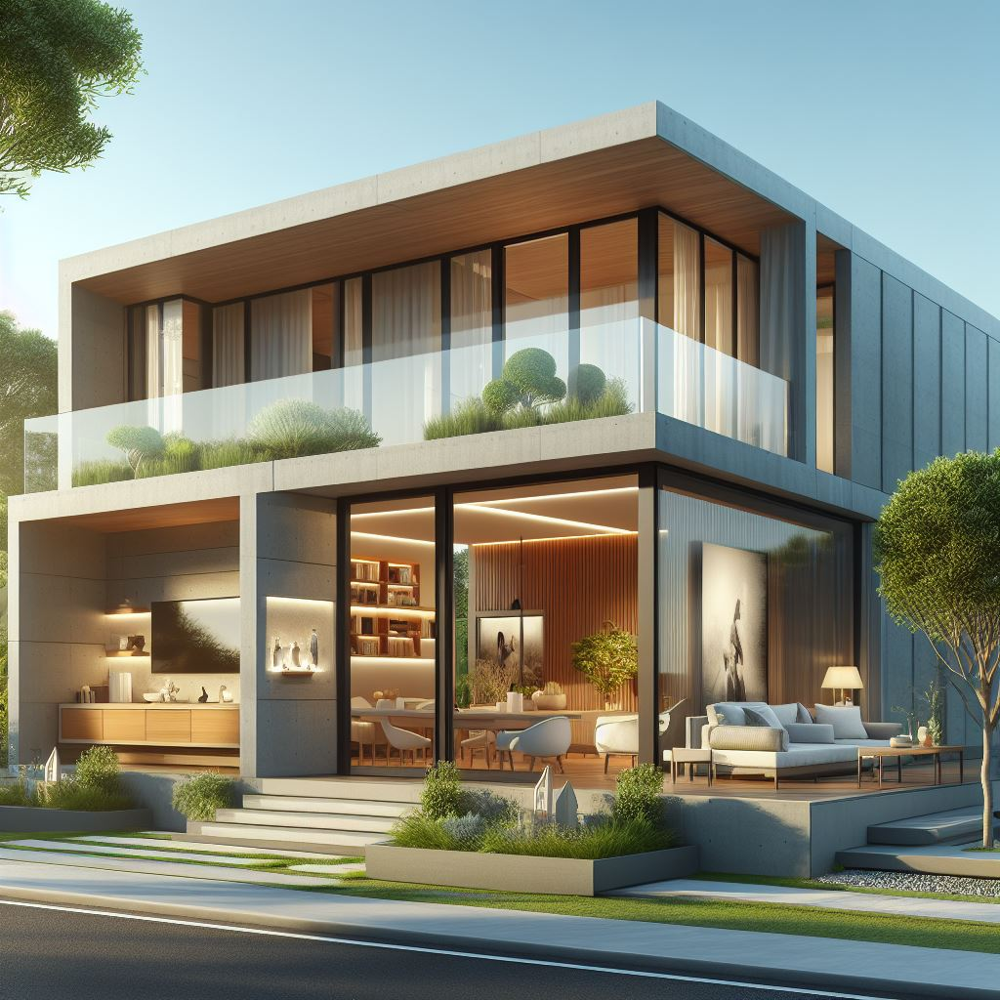

# SMART HOME

## DOCUMENTATION DU PROJET SMART-HOME RÉALISER PAR LES ETUDIANTS D'ESEO2-TOGO 

ce projet à éte réaliser par :
* ATADEGNON KODJO PIERRE : Kpatadegnon@gmail.com
* AWENA PIRENA ODETTE : awenaodette28@gmail.com
* GNASSINBGE EMILIE
* LEENAERTS LOIC HARRY :
* MEGUIDA ADEBAYO MOURAD :
* NONVIGNON KOKOU KENNETH :
* NADJOMBE ADAMA :

## Image de la maison / Vidéo

  ## Description du projet 

La **smart home**, également connue sous le nom de **maison intelligente**, est un concept qui intègre les nouvelles technologies pour améliorer le confort des occupants. Dans une smart home, les appareils sont connectés entre eux, et leur contrôle est centralisé. Par des **Technologies avancées** comme l'intelligence artificielle, la reconnaissance vocale ou faciale, et la lecture des empreintes digitales pour faciliter la vie quotidienne ensuite par la **Communication entre appareils** : Les différents équipements (ampoules, volets, prises, thermostats, etc.) communiquent entre eux via un réseau de communication. Cela permet un contrôle à distance et une automatisation des tâches.Egalement par **Confort personnalisé** : Grâce à la mise en place de scénarios et de régulations pièce par pièce, la smart home s'adapte aux besoins spécifiques de chaque occupant. Elle anticipe les besoins en termes de climat intérieur, de sécurité, et de gestion énergétique.  **Collaboration avec différents corps de métiers** : La mise en place d'une smart home nécessite une réflexion dès les premiers plans de construction. Elle implique une coordination avec l'architecte, le constructeur, le menuisier, le chauffagiste, l'électricien, et le plombier pour intégrer les capteurs, les systèmes de régulation, et les vannes commandées.

En somme, la smart home vise à rendre notre quotidien plus pratique, confortable et économe en énergie, tout en utilisant les dernières avancées technologiques.
reformule en un seul paraphe

  ## REMERCIEMMENTS 

  ## Sommaire
  
